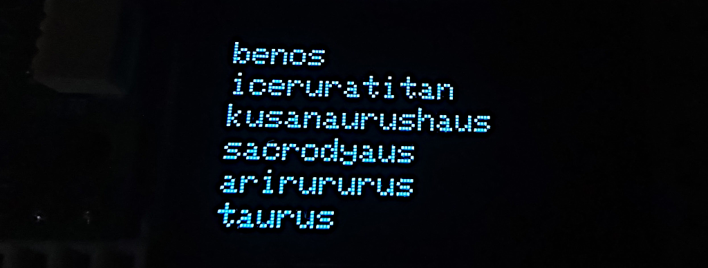

# Text generation on micro-controllers with CircuitPython and  Markov Chains

This code generates random text using character level [Markov Chains](https://en.wikipedia.org/wiki/Markov_chain). It has been written for [CircuitPython](https://docs.circuitpython.org/en/latest/README.html) and should run on [wide variety of boards](https://blog.adafruit.com/2019/01/26/circuitpython-is-supported-on-28-boards-and-2-more-that-are-shipping-but-not-in-releases-yet-for-a-total-of-30-different-boards-circuitpython-adafruit-arduino-bwshockley-electronicats-makerd/) supporting it. By default the code creates a character level Markov Chain which can be used for generating random dinosaur names. You can train a character level Markov Chain model on any type of data  using this code.

## Why CircuitPython and Markov Chains ?
- C++ is hard. Setting up dev environment for TFlite and board's SDK can be challenging for newbies.
- CircuitPython has many useful libraries available out of box.
- Loading TFLite models is currently not supported by CircuitPython. Checkout [this open source project](https://github.com/mocleiri/tensorflow-micropython-examples) for progress in this direction .
- RNNs are complicated and use more memory.
- Markov Chains are simpler and lightweight !

## Steps to run

- Download the file https://raw.githubusercontent.com/junosuarez/dinosaurs/master/dinosaurs.csv
- Generate a Markov Chain model from your text file using **src/generate_chain.py** (by default it generates the *dino_chain.json* file).  
- Copy **src/generate_text.py**, **src/markov_chain_parser.py** and **src/dino_chain.json** to your CircuitPython device.
- Check output on a serial monitor.

> Alternatively you can skip Steps 1 and 2, and   run the '*src/text-generation-on-microcontrollers.ipynb*' Jupyter notebook to generate **dino_chain.json**. This notebook is also available on Kaggle: https://www.kaggle.com/code/finalepoch/text-generation-on-microcontrollers

## Output on serial monitor
This program (*src/generate_text.py*) outputs data to serial port. It uses CircuitPython's '*printf*' statement to write data.

## Output on OLED display 

This program (*src/generate_text_oled.py*) requires an I2C OLED display (128x64) to be connected to the board. The example assumes Pi Pico board, so the OLED is connect to GP5(SLK) and GP4(SDA)

